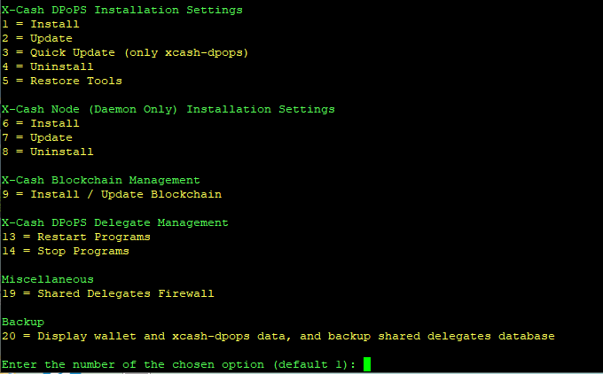

# Node Program Installation

## Introduction

!!! info
    This guide assumes you have already followed the [Server Setup Guide](../server-setup-guide/) and are comfortable managing a Linux server.

This guide walks you through installing, registering, and preparing a delegate node. By the end of the guide, your node will be ready to participate in securing the X-Cash public network (once elected as a delegate 😉).

The `xcash-dpops` program manages block validation, delegate communication, block production, and voter reward distribution.

---

## Requirements

### Dependencies

!!! info
    Dependencies are automatically installed and maintained by the installer script.

---

## Installation

The installer script is designed to interact with the `xcash-dpops` program and provide guided steps for installation, updates, and service management. It can also be used to restart services if you are not comfortable managing them manually from the command line.

Once your Linux instance is prepared (see the [Server Setup Guide](../server-setup-guide/)), run the installer script to install, build, and configure the delegate node. The installer will also download and synchronize the blockchain.

To start the installation process, run the latest version of the installer script:

```bash
bash -c "$(curl -fsSL https://raw.githubusercontent.com/Xcash-Labs/xcash-labs-dpops/master/scripts/autoinstaller/autoinstaller.sh)"
```


!!! info
    It is strongly recommended to run the installer inside a terminal multiplexer such as **byobu** or **tmux** to prevent interruptions caused by SSH disconnects.

Choose **Install** from the installer menu to begin.

---

### 1. Installation Directories

You will be prompted to select directories for:

- The `xcash-dpops` program  
- Blockchain data  
- Delegate database  

!!! warning
    Use the default paths unless you have a specific reason. Several tools depend on these locations.

---

### 2. Delegate Mode

You will choose between **shared** and **solo** delegate modes.

**Shared Delegate**

- Rewards automatically distributed to voters  
- Suitable for community-operated delegates  
- Requires prefunding the delegate wallet  

!!! info
    Shared delegates must prefund their wallet to ensure early reward payouts.

**Solo Delegate**

- Self-voted delegate  
- Rewards paid only to delegate wallet  
- Manual reward management  

!!! info
    This setting can be changed later using the installer menu.

Press **Enter** for shared delegate, or type `No` for solo delegate.

---

### 3. Block Reward Wallet

You must configure a wallet to receive block rewards.

Options:

- Create a new wallet  
- Restore an existing wallet from mnemonic seed  

If creating a new wallet, you may:

- Automatically generate a password  
- Provide a custom password  

If restoring, you will be prompted for the mnemonic seed and a new password.

---

### 4. Block Verifier Keys

Each delegate is identified by a block verifier key.

Options:

- Create a new key pair  
- Import an existing private key  

!!! danger
    Securely back up your block verifier keys. Loss will permanently prevent delegate operation and may result in loss of funds.

---

### 5. Finishing Installation

An installation summary will be displayed before execution.

!!! warning
    Wallet passwords are shown once more at the end. Store them securely.

The installer will:

- Build and install dependencies  
- Download the blockchain  
- Create and synchronize the delegate wallet  

!!! info
    Initial synchronization may take several hours depending on system performance and network speed.

Once complete, your delegate wallet details will be displayed.

!!! danger
    Back up all wallet and verifier information immediately. Loss is irreversible.

By default, the wallet is stored in:

